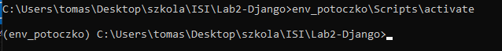

#### Blog w Django

I. Dokumentacja - [Django Girls](https://tutorial.djangogirls.org/pl/)

II. Uwagi  
- każdą czynność zrealizowaną wpisujemy do punktu nr III wraz z użytą komendą, np.  
```bash
python manage.py makemigrations
```
- wymagane konto na [Python Anywhere](https://www.pythonanywhere.com/),  
- proszę o utworzenie nazwy użytkownika na Python Anywhere, takiej jak na Discordzie,  

III. Kolejne kroki
- tworzymy folder roboczy dla naszego projektu, np. `blog-django-girls`,  
- utworzenie środowiska wirtualnego, nazwa środowiska powinna zawierać nr albumu lub nick z Discorda:  
```bash
python3 -m venv env_potoczko
```
- aktywacja środowiska wirtualnego:  
```cmd
env_potoczko\Scripts\activate
```
- po aktywacji środowiska wracamy do folderu roboczego, czyli `blog-django-by-girls`
- robimy screenshot z aktywnym środowiskiem wirtualnym i wrzucamy jako obrazek do README, np.  


- dodajemy nazwę śrowiska wirtualnego do pliku `.gitignore`:  
```bash
# .gitignore
env_potoczko/
```
- pip install django

- django-admin.exe startproject mysite .

- python manage.py startapp blog

- add blog to mysite/settings.py installed apps section

- blog/models.py
```python
from django.conf import settings
from django.db import models
from django.utils import timezone


class Post(models.Model):
    author = models.ForeignKey(settings.AUTH_USER_MODEL, on_delete=models.CASCADE)
    title = models.CharField(max_length=200)
    text = models.TextField()
    created_date = models.DateTimeField(default=timezone.now)
    published_date = models.DateTimeField(blank=True, null=True)

    def publish(self):
        self.published_date = timezone.now()
        self.save()

    def __str__(self):
        return self.title
```

- python manage.py makemigrations blog

- python manage.py migrate blog

- edit blog/admin.py

```python
from django.contrib import admin
from .models import Post

admin.site.register(Post)
```
- python manage.py runserver

- python manage.py createsuperuser

- python manage.py migrate

- log in at  http://127.0.0.1:8000/admin/

- log into PythonAnywhere, make an account and make API token

- create a bash console and ```run pip3.8 install --user pythonanywhere```

- pa_autoconfigure_django.py --python=3.8 https://github.com/LobsterLobsterski/ISI.git (a log in may be necessary)

- wait until it does everything

- something broke, i imagine its the fact that ISI repo is not just Lab2. Can be bothered to fix it, i can't be bothered creating a repo for every lab for this subject -> no deployment

- mysite/urls.py
```python
"""mysite URL Configuration

[...]
"""
from django.contrib import admin
from django.urls import path

urlpatterns = [
    path('admin/', admin.site.urls),
    path('', include('blog.urls')),
]
```
-blog/urls.py
```python
from django.urls import path
from . import views

urlpatterns = [
    path('', views.post_list, name='post_list'),
]
```
- blog/views.py
```python
from django.shortcuts import render
def post_list(request):
    return render(request, 'blog/post_list.html', {})
```
- create /blog/templates/blog/post_list.html
- blog/templates/blog/post_list.html
```HTML
<!DOCTYPE html>
<html>
    <head>
        <title>Django Girls blog</title>
    </head>
    <body>
        <header>
            <h1><a href="/">Django Girls Blog</a></h1>
        </header>

        <article>
            <time>published: 14.06.2014, 12:14</time>
            <h2><a href="">My first post</a></h2>
            <p>Aenean eu leo quam. Pellentesque ornare sem lacinia quam venenatis vestibulum. Donec id elit non mi porta gravida at eget metus. Fusce dapibus, tellus ac cursus commodo, tortor mauris condimentum nibh, ut fermentum massa justo sit amet risus.</p>
        </article>

        <article>
            <time>published: 14.06.2014, 12:14</time>
            <h2><a href="">My second post</a></h2>
            <p>Aenean eu leo quam. Pellentesque ornare sem lacinia quam venenatis vestibulum. Donec id elit non mi porta gravida at eget metus. Fusce dapibus, tellus ac cursus commodo, tortor mauris condimentum nibh, ut f.</p>
        </article>
    </body>
</html>
```

- if deployment works, git commit, git push and then git pull on the server console

- blog/views.py
```python
from django.shortcuts import render
from django.utils import timezone
from .models import Post


# Create your views here.
def post_list(request):
    posts = Post.objects.filter(published_date__lte=timezone.now()).order_by('published_date')
    return render(request, 'blog/post_list.html', {'posts': posts})
```

- replace <article>s with in the template
```html

    <article>
        <time>published: {{ post.published_date }}</time>
        <h2><a href="">{{ post.title }}</a></h2>
        <p>{{ post.text|linebreaksbr }}</p>
    </article>

```

- create /blog/static/css/blog.css

- add at the beggining of template

- add <link rel="stylesheet" href=""> to the template

- add page-header class to the header and container class to its div

- add post class to articles

- blog.css
```css
.page-header {
    background-color: #C25100;
    margin-top: 0;
    margin-bottom: 40px;
    padding: 20px 20px 20px 40px;
}

.page-header h1,
.page-header h1 a,
.page-header h1 a:visited,
.page-header h1 a:active {
    color: #ffffff;
    font-size: 36pt;
    text-decoration: none;
}

h1,
h2,
h3,
h4 {
    font-family: 'Lobster', cursive;
}

.date {
    color: #828282;
}

.save {
    float: right;
}

.post-form textarea,
.post-form input {
    width: 100%;
}

.top-menu,
.top-menu:hover,
.top-menu:visited {
    color: #ffffff;
    float: right;
    font-size: 26pt;
    margin-right: 20px;
}

.post {
    margin-bottom: 70px;
}

.post h2 a,
.post h2 a:visited {
    color: #000000;
}

.post > .date,
.post > .actions {
    float: right;
}

.btn-secondary,
.btn-secondary:visited {
    color: #C25100;
    background: none;
    border-color: #C25100;
}

.btn-secondary:hover {
    color: #FFFFFF;
    background-color: #C25100;
}
```

- replace old post loop within template with
```html
<main class="container">
    <div class="row">
        <div class="col">
            
                <article class="post">
                    <time class="date">
                        {{ post.published_date }}
                    </time>
                    <h2><a href="">{{ post.title }}</a></h2>
                    <p>{{ post.text|linebreaksbr }}</p>
                </article>
            
        </div>
    </div>
</main>
```

- create templates/blog/base.html
```html

<!DOCTYPE html>
<html>
    <head>
        <title>Django Girls blog</title>
        <link rel="stylesheet" href="https://cdn.jsdelivr.net/npm/bootstrap@5.1.3/dist/css/bootstrap.min.css" integrity="sha384-1BmE4kWBq78iYhFldvKuhfTAU6auU8tT94WrHftjDbrCEXSU1oBoqyl2QvZ6jIW3" crossorigin="anonymous">
        <link rel="stylesheet" href="https://fonts.googleapis.com/css?family=Lobster&subset=latin,latin-ext">
        <link rel="stylesheet" href="">
    </head>
    <body>
        <body>
            <header class="page-header">
              <div class="container">
                  <h1><a href="/">Django Girls Blog</a></h1>
              </div>
            </header>
            <main class="container">
                <div class="row">
                    <div class="col">
                    
                    
                    </div>
                </div>
            </main>
        </body>
    </body>
</html>
```

- replace post_list.html with
```html



    
        <article class="post">
            <time class="date">
                {{ post.published_date }}
            </time>
            <h2><a href="">{{ post.title }}</a></h2>
            <p>{{ post.text|linebreaksbr }}</p>
        </article>
    

```


