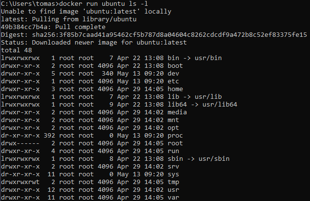
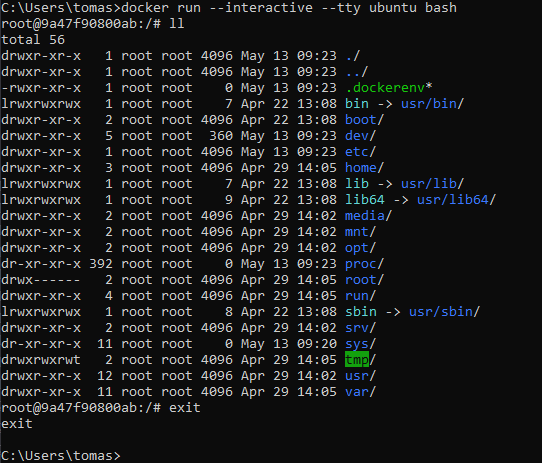
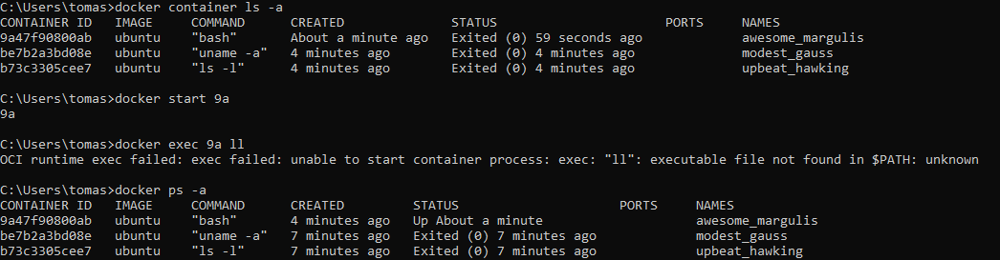
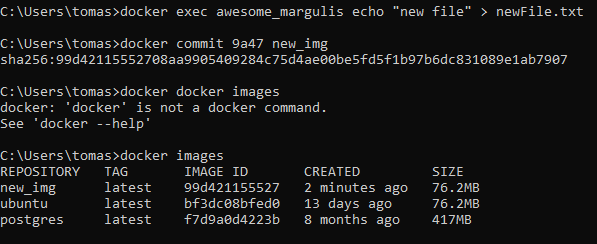
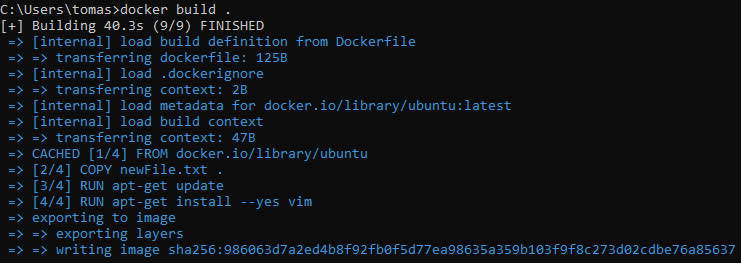

### Docker 2
creating new container and running a commond with it

opening bash in newly created container

starting a previously created container and running a comand


### Docker 3
creating new images


### Docker 4
docker hub cool

docker pull -name-

docker tag -old name- -new name-

docker push -some name-/-some name2-
### Docker 5
can copy from container to host :)

src/dest - if have name_of_container:file then it will act on conatiner else on host

docker cp --src-- -dest-

### Docker 6
dockerfule :)
```DOCKERFILE
FROM ubuntu

COPY new_file.txt .

RUN apt-get update
RUN apt-get install --yes vim
```
bengier!

### Docker 7
docker build --tag -img name- -path to dockerfile-

img name - somename:ubuntu19 will be absed on ubuntu 19


### Docker 8
if path to docker file is not where we building then we need to add the -f flag

### Docker 9
make folder of some stuff

make docker file and copy our stuff in

CMD -command-

### Docker 10
ADD is like copy but:
- can copy from urls
- it unpacks tar files automatically 

WORKDIR -catalogue name- -> creates the catalogue and sets it to be the main one (i.e. everything happens there and not in root)

### Docker 11
ENTRYPOINT -["command1", ...]- -> works like cmd but if we pass additional parameters during docker run then they will be added to ENTRYPOINT and not overwrite it (like it would for CMD)

### Docker 12
Volume is a like a catalogue that persists between runs and containers

docker volume create -name-

docker volume ls

```bash
docker run --volume -volume name-:-catalogue it will replace-
```
now when we change things in the catalogue these changes persist because the volume we created is static

volume name can be a local catalogue

### Docker 13
```cmd
... -e -name-=-value- ...
```
allows us to set environmental variables in containers during execution of RUN command

### Docker 14
INSPECT -id- -> json fomatted data about container/volume 

### Docker 15
bridge network on docker connects all containers via network
```cmd
docker network create --driver[optional] -driver param- -name-
docker network create --driver bridge myNetwork
```
```
--network -nameOfNetwork-
```
allows us to connect out container to whatever network we want
```
docker network [connect/disconnect] -network name- -container name-
```
allows us to connect/disonnect containers to networks
```
docker attach -container name- 
```
allows us to access the shell of a running container
### Docker 16
adminer image allows us to connect to our databases
```
docker run -p -container port-:-local port- --network -networkName- adminer
```
### Docker 17
make docker-compose.yml file :)
```
docker-compose [up/down]
```
up sets it up, down takes it down
### Docker 18
```
docker-compose up -d --build
```

### Docker 19
nginx :))))()()()

no idea what this is for

### Docker 20
in one docker file we can have multiple FROMs
:o

this allows us to setup multiple containers at once!

### Docker 21
FROM scratch -> makes a completely empty image

this is good because we usually don't need everything in the image, we might just pass the complied app inside without any unnecessary files (lower weight, no shell, no ability to debug in the container, safer)

### Docker 22
combine RUN commands (eg. apt-get update && apt-get install ...) into one to create less image layers and save time and space 

.dockerignore works just like .gitignore
